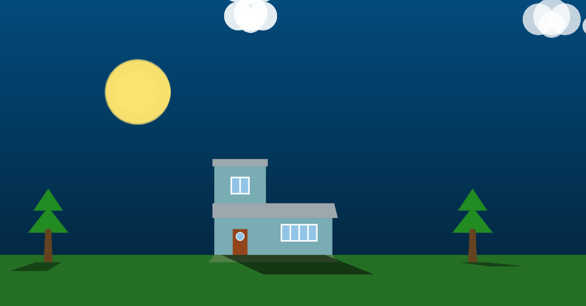
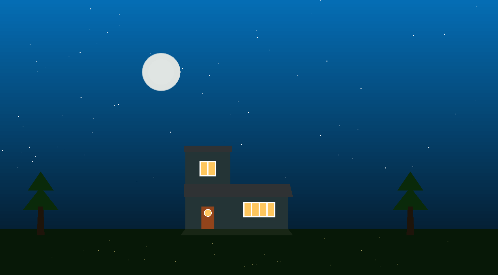
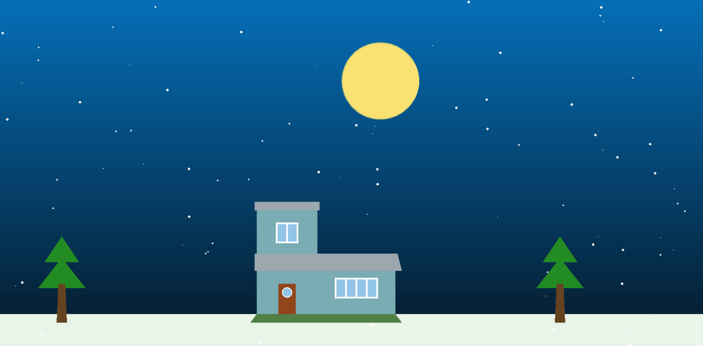
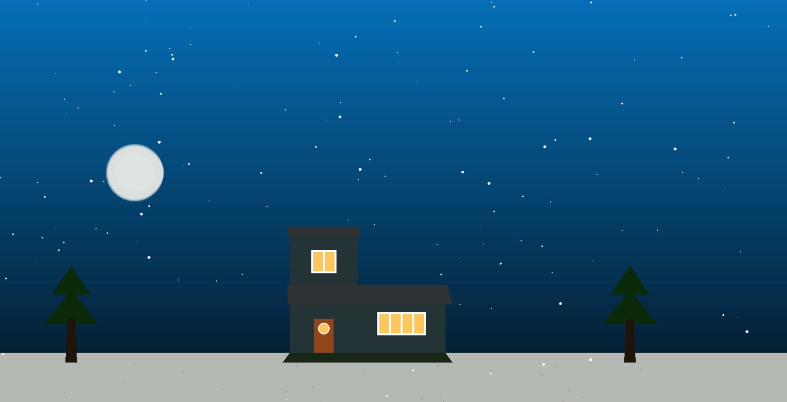

the sun. In addition to the daily cycle, the system supports seasonal changes, allowing the
timings, daylight duration, sky color tones, and environmental elements such as snow. By
environmental appearance.
day is mapped to a 24-hour cycle, which is further divided into day and night periods. Instead
# Day-Night Transition Simulation (Brief)

This project is a 2D PyOpenGL simulation that visualizes a full day-night cycle with optional
seasonal variation. The scene is built from modular entities (background, celestial bodies,
ground, trees, house, clouds, fireflies, snow) that are orchestrated by a single scene manager.
Each entity focuses on one visual responsibility, while the scene controls time, state changes,
and draw order.

## How the System Is Organized

- main.py creates the OpenGL window, handles input, and starts the render loop.
- src/scene.py is the coordinator. It initializes all entities, advances time, switches
	day or night, and renders everything in the correct order each frame.
- src/config.py centralizes all constants (colors, speeds, sizes, positions, schedules).
- src/entities/ contains independent drawing logic for each visual element.

## How Time Drives the Simulation

Time is modeled as a continuous cycle. The sun and moon move along a semi-circular arc using
trigonometric functions, and the current angle is converted into a simulated hour. That angle
also drives brightness, which controls:

- sky and ground color interpolation
- sun and moon glow intensity
- shadow length and direction
- visibility of stars and fireflies

## How Things Connect

- The scene updates sun or moon angle each frame based on the active period (day or night).
- Brightness is derived from the angle (sin curve), then passed to background and ground to
	blend between day and night colors.
- Entities switch behavior based on the scene time: stars and fireflies appear at night,
	clouds show only during day, snow appears only in winter.
- Shadows are rendered using the sun position and disabled in winter to keep the view clear.

## Rendering Flow (Per Frame)

1. Background gradient is drawn.
2. Ground and snow cover (if winter) are drawn.
3. Stars and clouds are drawn.
4. Snowfall particles (winter) are updated and drawn.
5. Landscape objects (trees, house) and shadows are drawn.
6. Fireflies are drawn.
7. Sun or moon is drawn last with glow.
8. The on-screen time HUD is rendered on top.

## User Interaction

- H: Show help in console
- S: Toggle season (summer or winter)
- 00-23: Jump to a specific hour
- Q: Quit

## Screenshots

